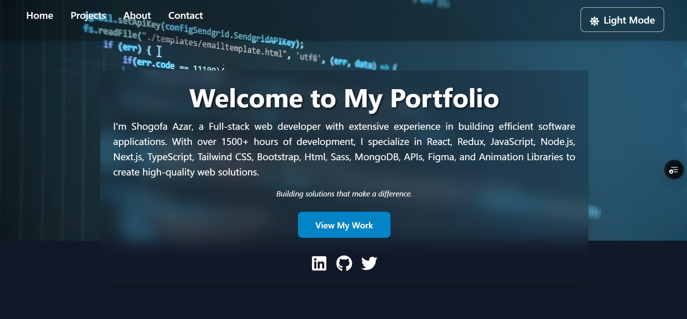

# My Portfolio Project 🚀

Welcome to my portfolio project, a comprehensive web application designed to showcase my skills and projects in web development. This platform provides a detailed look at the applications and tools I've developed.

## Table of Contents

- [Project Overview](#project-overview)
- [Features](#features)
- [Technologies Used](#technologies-used)
- [Getting Started](#getting-started)
- [Deployment](#deployment)
- [Live Link](#live-link)
- [GIF Showcase](#gif-showcase)
- [Authors](#authors)
- [Contributing](#contributing)
- [Show Your Support](#show-your-support)
- [License](#license)

## Project Overview

My portfolio project is built to demonstrate my abilities as a web developer. Key features include:

- **🖥️ Project Showcase**: View and interact with my latest projects.
- **📚 Skills Section**: Detailed descriptions of the technologies and tools I work with.
- **📞 Contact Form**: Reach out for inquiries, collaborations, or opportunities.

This project highlights my skills in front-end development, user experience design, and responsive web design.

## Features

- **Project Gallery**: A collection of my projects with in-depth descriptions.
- **Skills Overview**: Information about the technologies I use and my proficiency.
- **Contact Form**: A simple way to get in touch with me for any inquiries.

## Technologies Used

- **React**: A JavaScript library for building interactive user interfaces.
- **JavaScript**: The core language for application logic and functionality.
- **HTML/CSS**: For structuring and styling the application.
- **Tailwind CSS**: A utility-first CSS framework that allows for rapid UI development.
- **Vercel**: A platform for deployment and hosting.

## Getting Started

To set up the portfolio project locally, follow these steps:

1. **Clone the Repository**:

   ```bash
   git clone https://github.com/shogof/shogof_portofolio
   ```

2. **Navigate to the Project Directory**:

   ```bash
   cd your-portfolio
   ```

3. **Install Dependencies**:

   ```bash
   npm install
   ```

4. **Start the Development Server**:
   ```bash
   npm start
   ```
   The application will be accessible at [http://localhost:3000](http://localhost:3000).

## Deployment

To prepare the application for production, follow these steps:

1. **Build the Application**:
   ```bash
   npm run build
   ```
   This command generates an optimized production build in the `build` directory.

## Live Link

Experience my portfolio live here: [Live Demo](https://shogof-portofolio-fdzfw9q8x-shogofs-projects.vercel.app/)

## GIF Showcase

Check out the following Image that demonstrates the key features of my portfolio:




## Authors

- **Your Name**
  - GitHub: [@shogof](https://github.com/shogof)
  - LinkedIn: [LinkedIn](https://www.linkedin.com/in/shegofa-developer-aa362030b)
  - Email: [email](shogofadeveloper12@gmail.com)

## Contributing

I welcome contributions, issue reporting, and feature requests. Feel free to open an issue or submit a pull request.

## Show Your Support

If you like this project, please consider giving it a ⭐ on GitHub.

## License

This project is licensed under the MIT License.
